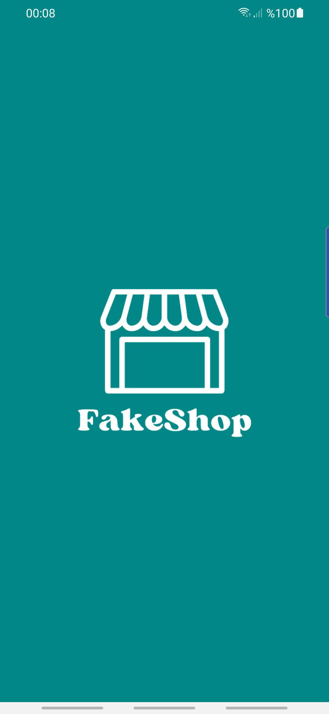
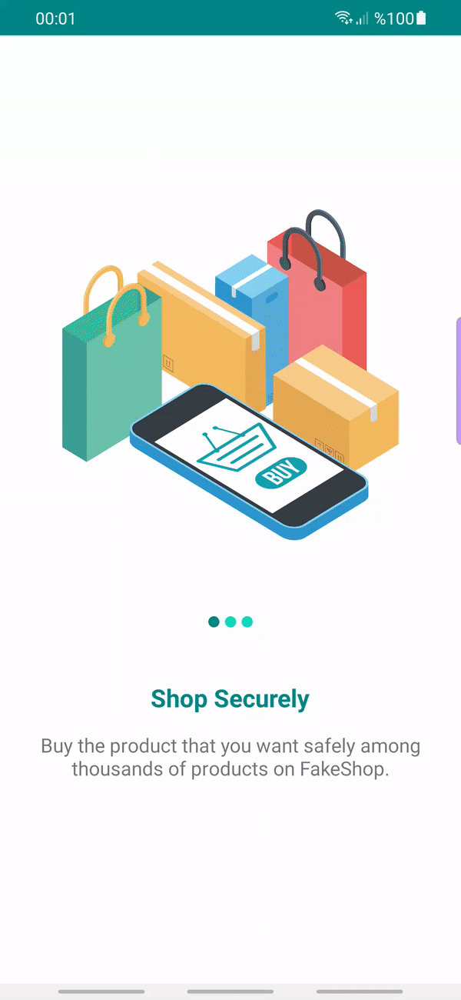
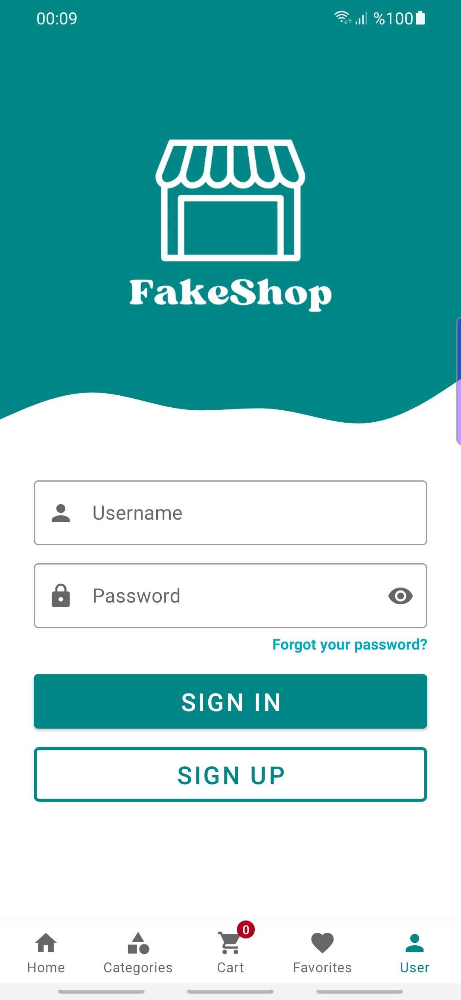
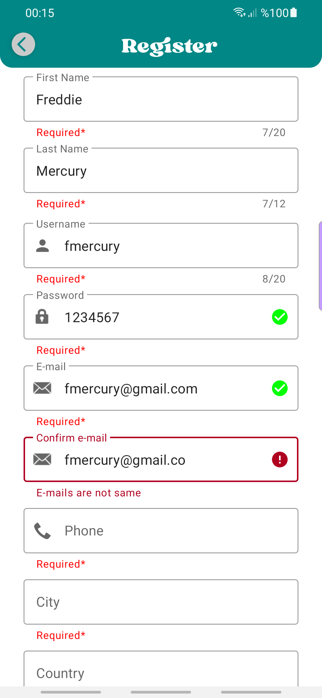
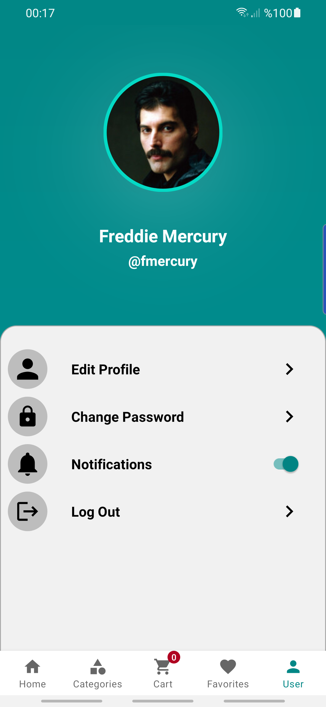
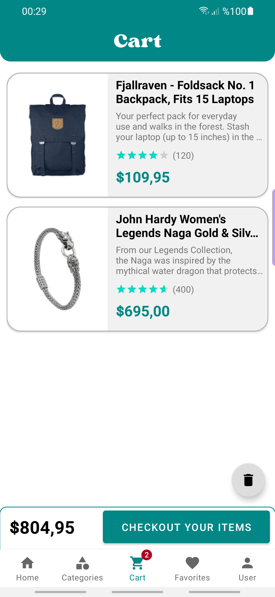
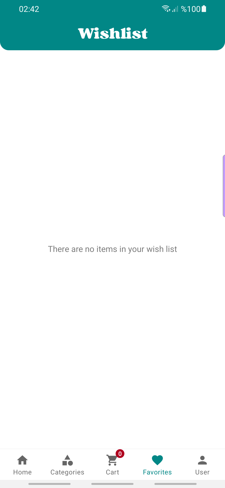
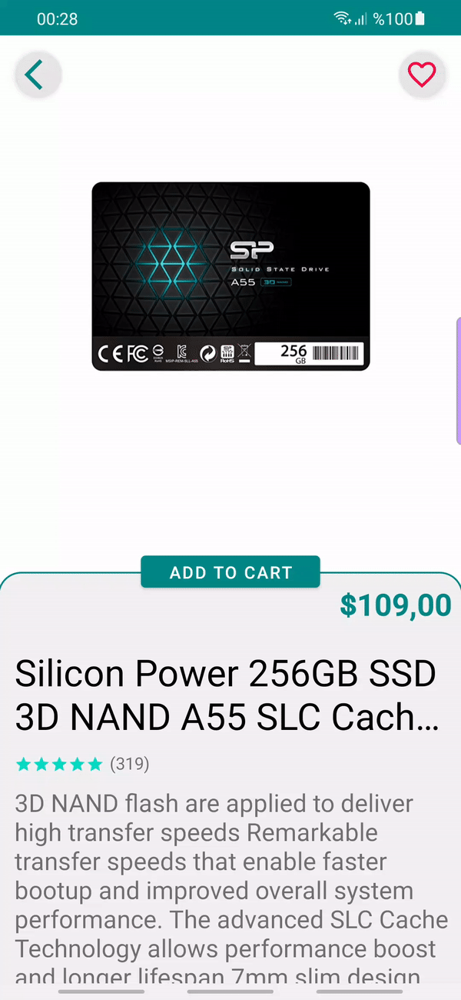
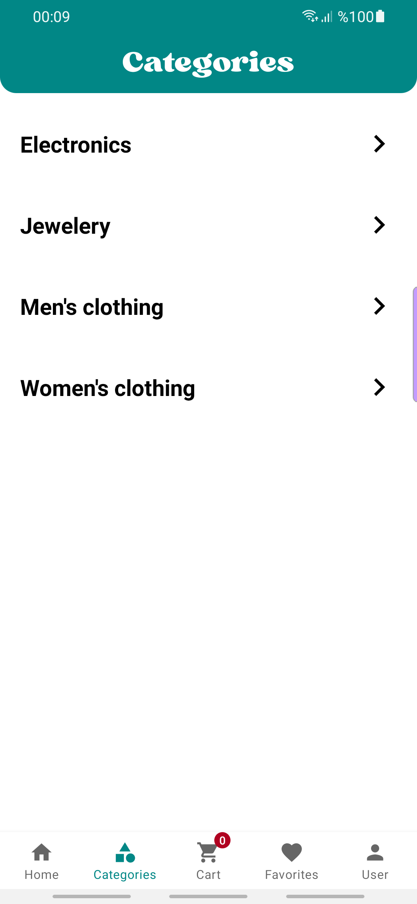
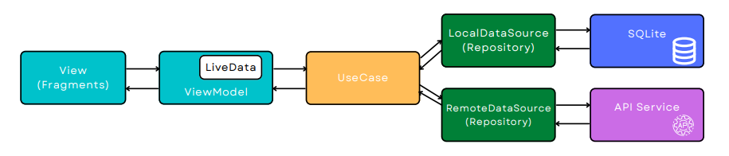

# FakeShop
[](http://developer.android.com/index.html)
[](https://developer.android.com/studio)
[](https://kotlinlang.org/)
[](https://m3.material.io/)


FakeShop is an android application for practicing and gaining skills in Kotlin language created through an api with pseudo-real data.

## Contents
* [Images](#images)
* [Tech Stacks](#tech-stacks)
* [Architecture](#architecture)
* [Services](#services)
* [Download](#download)

## Images

Splash Screen             | Onboarding Screen     | Home Screen
:-------------------------:|:-------------------------:|:-------------------------:
            |    |   |

Login Screen            | Register Screen               | Userpanel Screen
:-------------------------:|:-------------------------:|:-------------------------:
           |                |   |

Products Screen            | Cart Screen               | Wish List Screen
:-------------------------:|:-------------------------:|:-------------------------:
           |                |   |

Details Screen            | Category Screen               | Forgot Password Screen
:-------------------------:|:-------------------------:|:-------------------------:
           |                |   |


## Tech Stacks

- [Kotlin](https://developer.android.com/kotlin) - Kotlin is a programming language that can run on JVM. Google has announced Kotlin as one of its officially supported programming languages in Android Studio; and the Android community is migrating at a pace from Java to Kotlin.
- [Android KTX](https://developer.android.com/kotlin/ktx.html) - Android KTX is a set of Kotlin extensions that are included with Android Jetpack and other Android libraries. KTX extensions provide concise, idiomatic Kotlin to Jetpack, Android platform, and other APIs.
- [AndroidX](https://developer.android.com/jetpack/androidx) - Major improvement to the original Android [Support Library](https://developer.android.com/topic/libraries/support-library/index), which is no longer maintained.
- [Lifecycle](https://developer.android.com/topic/libraries/architecture/lifecycle) - Lifecycle-aware components perform actions in response to a change in the lifecycle status of another component, such as activities and fragments. These components help you produce better-organized, and often lighter-weight code, that is easier to maintain.
- [ViewModel](https://developer.android.com/topic/libraries/architecture/viewmodel) -The ViewModel class is designed to store and manage UI-related data in a lifecycle conscious way.
- [Room database](https://developer.android.com/training/data-storage/room) - The Room persistence library provides an abstraction layer over SQLite to allow fluent database access while harnessing the full power of SQLite.
- [Kotlin Coroutines](https://developer.android.com/kotlin/coroutines) - A concurrency design pattern that you can use on Android to simplify code that executes asynchronously.
- [Retrofit](https://square.github.io/retrofit) -  Retrofit is a REST client for Java/ Kotlin and Android by Square inc under Apache 2.0 license. Its a simple network library that is used for network transactions. By using this library we can seamlessly capture JSON response from web service/web API.
- [GSON](https://github.com/square/gson) - JSON Parser,used to parse requests on the data layer for Entities and understands Kotlin non-nullable and default parameters.
- [Dagger Hilt](https://developer.android.com/training/dependency-injection/hilt-android) - A dependency injection library for Android that reduces the boilerplate of doing manual dependency injection in your project.
- [Glide](https://github.com/bumptech/glide) - Glide is a fast and efficient open source media management and image loading framework for Android that wraps media decoding, memory and disk caching, and resource pooling into a simple and easy to use interface.
- [Shimmer](https://github.com/facebook/shimmer-android) - Shimmer is an Android library that provides an easy way to add a shimmer effect to any view in your Android app.
- [ViewPager](https://developer.android.com/reference/kotlin/androidx/viewpager/widget/ViewPager) - ViewPager in Android allows the user to flip left and right through pages of data.

## Architecture

 


## Services

- [FakeStoreApi](https://fakestoreapi.com/) - FakeStoreApi is a free online REST API that you can use whenever you need Pseudo-real data for your e-commerce or shopping website without running any server-side code.


## Download

```
$ git clone https://github.com/KemalTalas/FakeShop
```
